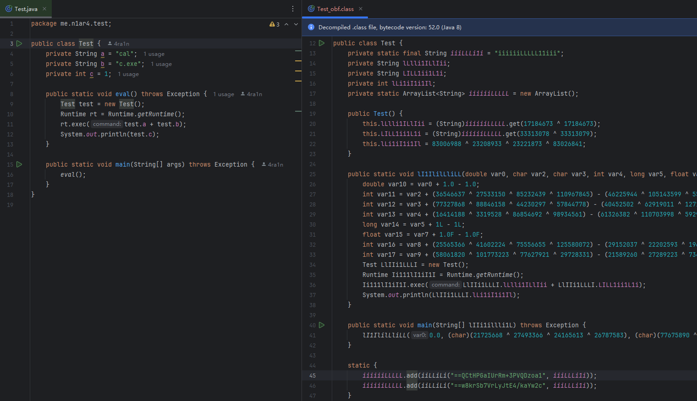
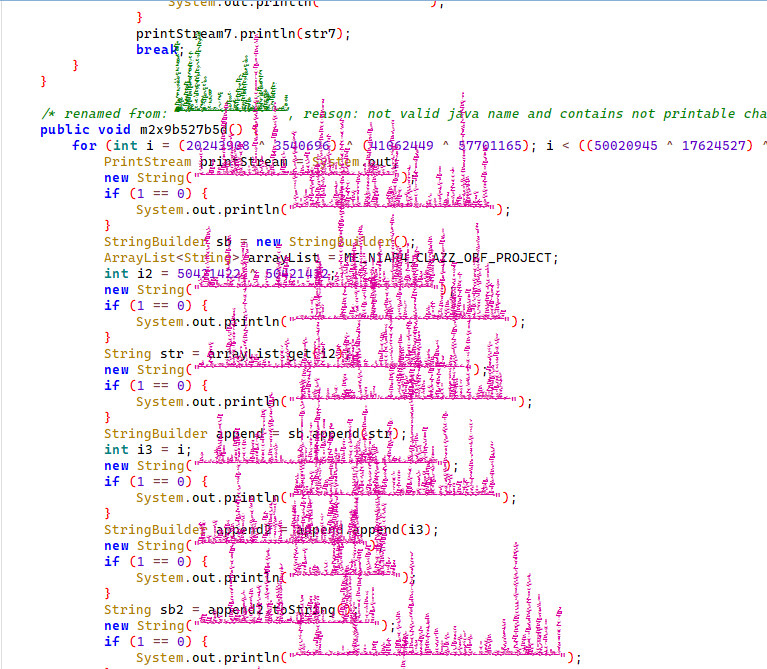
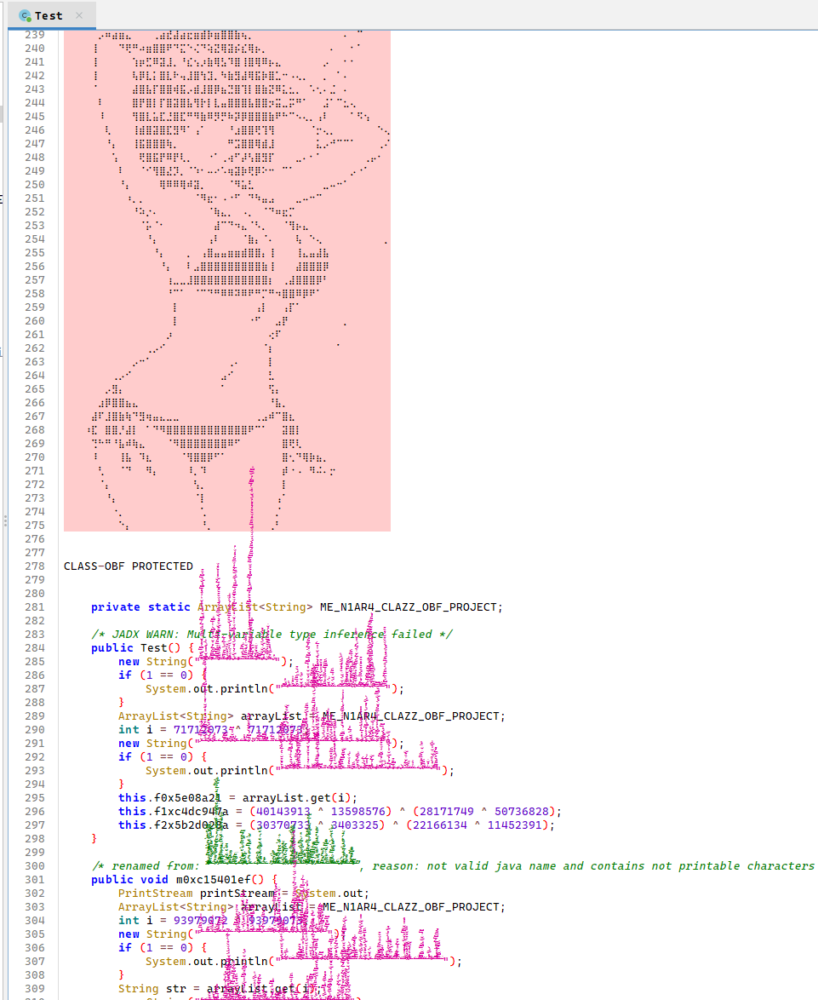
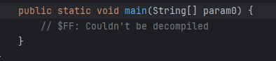
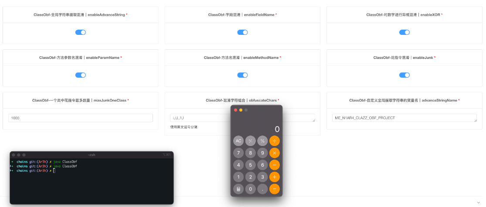
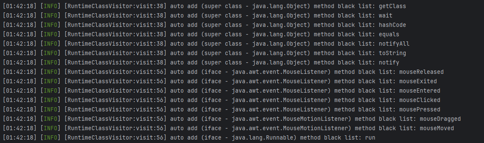

# class-obf

[CHANGE LOG](CHANGELOG.MD)


`class-obf` 项目全称 `Class Obfuscator` 项目，专门用来混淆单个 `Class` 文件

示例图：混淆前 -> 混淆后（最基础方案）





基于错误的注解可以实现反编译时显示图案（以下图片为 `jadx` 反编译截图）



从 `1.9.0` 版本后新增简单的 `AI` 对抗和 `IDEA` 报错对抗




从 `1.10.0` 版本后新增各种先进的混淆手法

本项目已深度集成到 `web-chains` 项目中 (https://github.com/vulhub/java-chains)



本项目另外被多个 **非开源安全工具** 集成和使用，逐步完善中

## 介绍

工具介绍

- 仅针对单个 `Class` 文件
- 命令行输出改善，详细展示混淆细节
- 你可以只混淆你项目的核心类替换即可（方便快速）
- 提供了多种方式的 `API` 调用

### 混淆功能列表

| 功能名称      | 配置项 (Key)                 | 默认值     | 描述                        |
|:----------|:--------------------------|:--------|:--------------------------|
| 删除编译信息    | `enableDeleteCompileInfo` | `true`  | 删除调试信息无法被调试               |
| 字段名混淆     | `enableFieldName`         | `true`  | 将类中的字段名修改为无意义字符           |
| 方法名混淆     | `enableMethodName`        | `true`  | 将类中的方法名修改为无意义字符           |
| 参数名混淆     | `enableParamName`         | `true`  | 删除或混淆方法参数名称信息             |
| 隐藏方法      | `enableHideMethod`        | `false` | 尝试隐藏方法不被反编译工具发现           |
| 隐藏字段      | `enableHideField`         | `false` | 尝试隐藏字段不被反编译工具发现           |
| XOR 混淆    | `enableXOR`               | `true`  | 简单的异或运算混淆                 |
| AES 字符串加密 | `enableAES`               | `true`  | 使用 AES 算法加密字符串常量          |
| 高级字符串混淆   | `enableAdvanceString`     | `true`  | 更复杂的字符串处理混淆               |
| 花指令混淆     | `enableJunk`              | `true`  | 插入无效的指令迷惑分析者              |
| 坏注解混淆     | `enableBadAnno`           | `false` | 插入错误的注解对抗反编译器             |
| AI 对抗     | `antiAI`                  | `false` | 针对 AI 分析工具的对抗混淆           |
| 动态调用      | `enableInvokeDynamic`     | `false` | 使用动态调用指令对抗反编译器            |
| 图片崩溃      | `enableImageCrash`        | `false` | 对抗 `Java Swing` 反编译工具     |
| 成员乱序      | `enableShuffleMember`     | `false` | 打乱类成员方法和字段的顺序             |
| 控制流混淆     | `enableControlFlow`       | `false` | 简单的方法代码控制流混淆              |
| 数学方法混淆    | `enableTrim`              | `false` | 对数学方法进行特殊混淆手段             |
| 方法膨胀      | `enableExpandMethod`      | `false` | 通过增加无用参数迷惑分析者             |
| 花指令使用特殊字符 | `enableEvilString`        | `false` | 使用特殊字符对抗反编译和迷惑分析者         |
| 特殊字符替换    | `useEvilCharInstead`      | `false` | 使用恶意字符替换原有字符              |
| 更多配置...   | ......                    | ...     | 请参考自动生成的 `config.yaml` 文件 |


如果你有 `Jar` 混淆的需求：

- 可以把核心业务提取到一个 `class` 中通过该工具保护好这一个 `class`
- 使用 `https://allatori.com/` 商业化混淆器
- 使用 `https://www.zelix.com/` 商业化混淆器

`class-obf` 相比商业化混淆器：

- 混淆强度接近商业化混淆器：稍弱于 `zkm` 混淆，接近 `allatori` 混淆
- 保持更新，学习先进商业混淆器的思路，逐步完善
- 完全开源，有功能问题可以提 `PR` 贡献
- 配置简单，配置的参数 **远少于** 商业化混淆器，上手非常容易
- 针对单个 `class` 混淆能力不弱，一般情况足够

## 快速开始

你可以使用代码方式调用（参考 `test` 目录的 `TestQuick/TestAPI` 文件）

本项目已上传了 `Maven` 中央仓库，可以直接引入和使用

```xml
<dependency>
    <groupId>io.github.4ra1n</groupId>
    <artifactId>class-obf</artifactId>
    <version>1.9.1</version>
</dependency>
```

最快速使用（使用默认配置输入文件返回 `base64` 字节码）

```java
String data = ClassObf.quickRun("Test.class");
System.out.println(data);
```

自行进行配置进阶写法

```java
BaseConfig config = new BaseConfig();
// 省略代码 自行配置 config

ClassObf classObf = new ClassObf(config);
// 支持三种重载：输入文件字符串，输入文件 PATH 对象，输入 byte[] 数据
Result result = classObf.run("Test.class");
if(result.getMessage().equals(Result.SUCCESS)){
    // result.getData() 即可得到混淆后的 byte[] 字节码
    System.out.println(Base64.getEncoder().encodeToString(result.getData()));
}
```

**注意：由于设计原因，混淆 `API` 不支持并发**

## 命令行使用

生成配置文件：`java -jar class-obf.jar --generate`

使用指定配置文件混淆当前目录的 `Test.class`

```shell
java -jar class-obf.jar --config config.yaml --input Test.class
```

## 常见问题

从 `1.5.0` 版本解决了缺少依赖的问题，如果你混淆时遇到报错找不到某些依赖类：

请将依赖的 `jar` 文件都放在当前目录下的 `class-obf-lib` 目录（会自动生成）

从 `1.7.1` 版本解决了中文字符串解密乱码的问题

如何处理继承/接口实现方法黑名单问题？第三方库无法支持，但是 `rt.jar` 可以支持

从 `1.9.1` 版本支持开启 `autoDisableImpl` 自动分析来自 `JDK` 的情况



## 配置文件

可以根据你的需求修改配置文件

```yaml
!!me.n1ar4.clazz.obfuscator.config.BaseConfig
# 日志级别
logLevel: info
# 是否使用安静模式（不打印调试信息）
quiet: false
# 是否启动 JAVA ASM 的 COMPUTE FRAMES/MAX 自动计算
# 如果遇到 TYPE * NOT PRESENT 报错可以尝试设置该选项为 FALSE
asmAutoCompute: true

# 混淆字符组合
# 建议使用长度大于等于 5 否则可能有预期外的 BUG
obfuscateChars:
  - "i"
  - "l"
  - "L"
  - "1"
  - "I"

# 是否开启删除编译信息
enableDeleteCompileInfo: true

# 是否开启方法名混淆
# 这里会自动修改方法之间的引用
enableMethodName: true
# 是否分析自动 Runtime 避免混淆 实现/重写 类
# 例如不应该混淆继承 HttpServlet 的 init/doGet/destroy 方法
autoDisableImpl: true
# 一般 public 方法是被外部调用的
# 可以设置该选项为 true 来跳过 public 方法混淆
ignorePublic: false
# 全局方法黑名单
# 该方法不会进行混淆 引用也不会被修改
methodBlackList:
  - "main"

# 是否开启字段混淆
enableFieldName: true
# 是否开启方法参数名混淆
# 由于反编译器 可能显示的结果只是 var0 var1 等
enableParamName: true
# 是否对数字进行异或混淆
enableXOR: true

# 对所有字符串进行 AES 加密
enableAES: true
# 默认 AES KEY 注意长度必须是 16
aesKey: OBF_DEFAULT_KEYS
# AES 解密方法名
aesDecName: iiLLiLi
# AES KEY 字段名
aesKeyField: iiiLLLi1i

# 是否启用全局字符串提取混淆
enableAdvanceString: true
# 全局提取字符串的变量名可以自定义
advanceStringName: ME_N1AR4_CLAZZ_OBF_PROJECT

# 是否开启花指令混淆
enableJunk: true
# 花指令混淆级别 1-5
junkLevel: 3
# 花指令可以使用常见的随机字符
# 也可以使用恶意的字符生成更具有迷惑的代码
enableEvilString: false
# 一个类中花指令最多数量
maxJunkOneClass: 1000

# 是否开启字段隐藏
# 可以防止大部分 IDEA 版本反编译
enableHideField: false
# 是否开启方法隐藏
# 可以防止大部分 IDEA 版本反编译
enableHideMethod: false

# 参数拓展混淆
# void a(int a) 可以拓展为 void a(int a,int b,int c,int d)
# 其中 b c d 都是无用参数
# 其中 int 类型不是固定的
# 会从 int bool byte char short long float double 中随机
enableExpandMethod: true
# 拓展多少个参数 默认 3 个
expandParamNum: 3
# expand 操作只会对白名单方法名进行混淆
expandMethodList:
  - "test"

# 使用恶意的字符替换方法名 字段名 参数名等
# 注意：如果开启了该项 obfuscateChars 将无效
# 注意：该功能不确定在所有版本 JAVA 上可以稳定运行
useEvilCharInstead: false

# 是否使用恶意的注解进行混淆
# 特点：可能导致 CLASS 文件无法被 IDEA 反编译
enableBadAnno: true
# 恶意注解混淆级别
# 1: 只给类添加
# 2: 给类和字段添加
# 3: 给类、字段、方法都添加
badAnnoLevel: 3
# 恶意注解显示的文本 从本地文件读取
badAnnoTextFile: bad-anno.txt

# 可能的 AI 反编译对抗
# 插入对抗 PROMPT 使得 AI 分析混淆代码可能失效
# 测试功能 实际发现很多大模型无法被打断
antiAI: false

# 是否启用 InvokeDynamic 混淆
# 将普通的 invoke 指令转换为 invokedynamic 指令
# 注意：只支持 STATIC 方法 且未经过完善的测试 可能不够稳定
enableInvokeDynamic: false

# 是否开启 Java Swing 编写的反编译器对抗
# Java Swing 默认可以注入 HTML 标签
# 使用错误的 img 标签可能导致部分 Swing 反编译器无法工作
enableImageCrash: false

# 类的方法和字段是有顺序的
# 开启该配置可以打乱顺序
enableShuffleMember: true

# 简单的控制流混淆
enableControlFlow: false

# 对数学方法进行特殊混淆手段
enableTrim: false
```

## 如何测试

如何测试你混淆后的单个 `class` 可用？

- 结合具体场景和项目测试，取决于实际情况
- 覆盖到 `jar` 文件中测试，比较麻烦
- 放到对应目录中使用 `java` 命令测试，更麻烦
- 使用自定义 `ClassLoader` 测试，方便快速

```java
public class Test extends ClassLoader {
    @Override
    protected Class<?> findClass(String name) throws ClassNotFoundException {
        byte[] classData = getClassData(name);
        if (classData == null) {
            throw new ClassNotFoundException(name);
        }
        return defineClass(name, classData, 0, classData.length);
    }

    private byte[] getClassData(String className) {
        if ("test.ClassName".equals(className)) {
            try {
                // read bytes form obfuscated class
                return Files.readAllBytes(Paths.get("Test_obf.class"));
            } catch (IOException e) {
                throw new RuntimeException(e);
            }
        }
        return null;
    }

    public static void main(String[] args) throws Exception {
        TestRunner loader = new TestRunner();
        Class<?> clazz = loader.loadClass("test.ClassName");
        Object instance = clazz.getDeclaredConstructor().newInstance();
        // usually main method
        Method method = clazz.getMethod("main", String[].class);
        method.invoke(instance, new Object[]{args});
    }
}
```

## Star

<div align="center">


</div>

## Thanks

Some ideas were referenced from other projects:

- https://github.com/sim0n/Caesium
